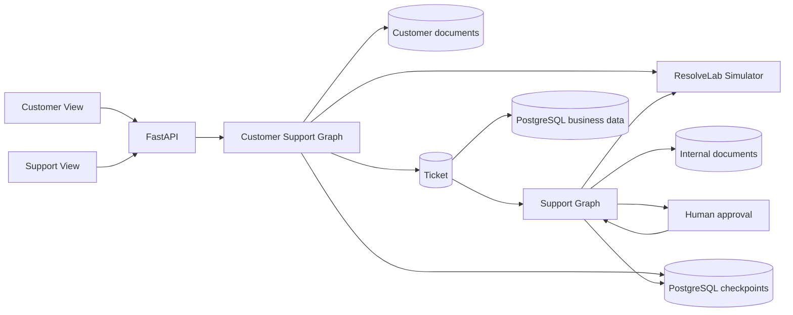
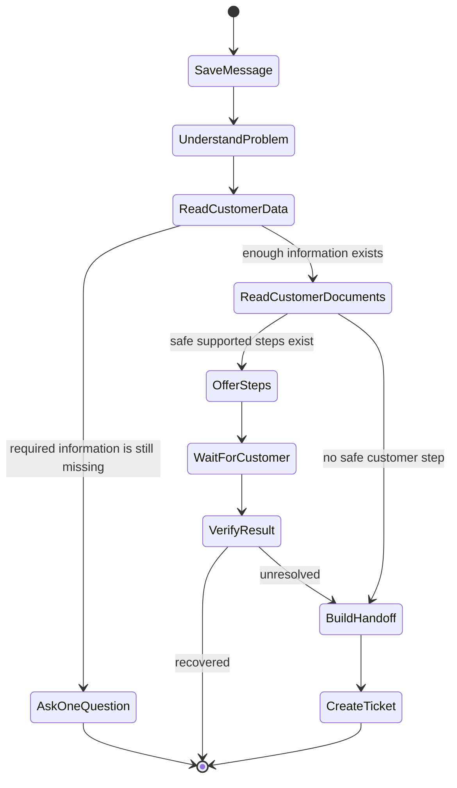
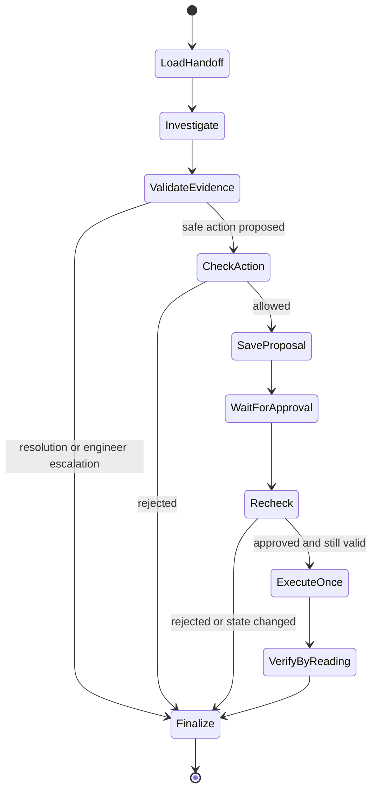
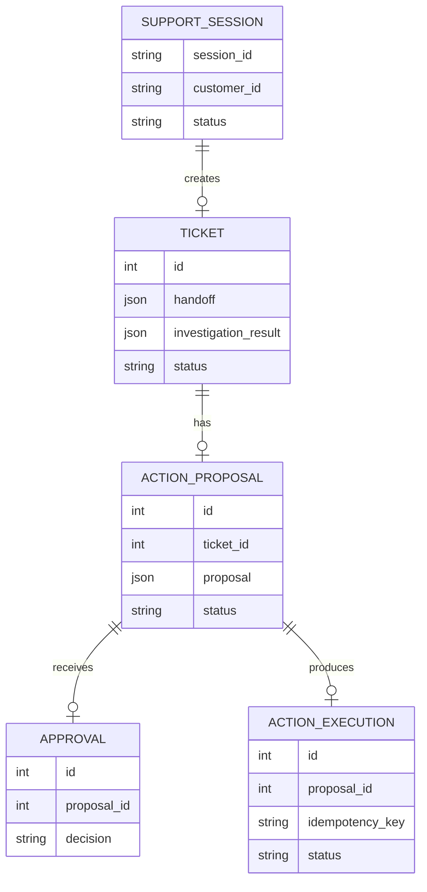

# ResolveAI Architecture Evidence

## System architecture

The browser only receives customer-safe fields in Customer View. Support View can read the saved handoff, evidence, diagnosis, approval, execution result, and escalation package.

## Customer Support Graph

## Support Graph

## Simplified data relationships

## Key decisions

1. The model can propose an action but cannot call a write tool.
2. Server code rebuilds action parameters from the current ticket, evidence, and ResolveLab state.
3. Approval pauses the saved Support Graph and resumes the same ticket after a decision.
4. A repeated write uses the same key, so ResolveLab changes state once.
5. A successful write response is not treated as recovery. The system reads the operation again before telling the customer it succeeded.
6. Customer and internal documents use separate filters and separate tool paths.

## Threat model

| Threat | Control | Evidence |
|---|---|---|
| Customer asks for another customer's data | Customer ID is bound by server code | Cross-customer evaluation cases and tool tests |
| Customer message tries to change system rules | Customer text is treated as untrusted data | Malicious customer cases |
| Document contains instructions for the model | Documents are treated as reference data and filtered by visibility, version, and feature | Malicious document case |
| Model cites a record that does not exist | Server validates evidence IDs and ownership | Evidence validation tests |
| Model tries to perform a write | No write tool is exposed to either model | Tool-list safety test |
| Action runs without approval | Execution checks the saved approval and fixed demo role | Approval bypass test |
| Retry runs more than once | Backend and ResolveLab use the same saved key | Repeated approval and retry tests |
| Service restarts during approval | Graph state is stored in PostgreSQL | Restart recovery test |

## Current limits

- The approval role is a fixed demo role, not a full sign-in and permission system.
- ResolveLab is a local simulator, not a production service.
- Only one approved write action is supported.
- Public cloud deployment is outside the current local delivery.
